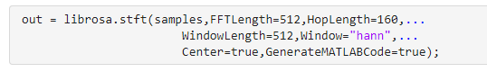
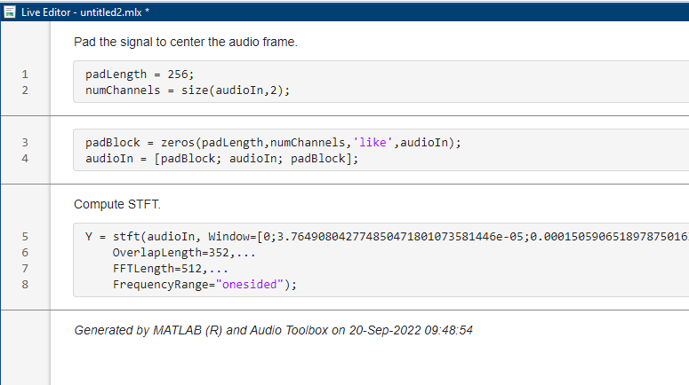
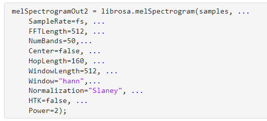
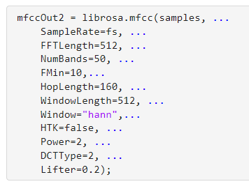
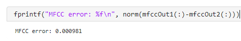
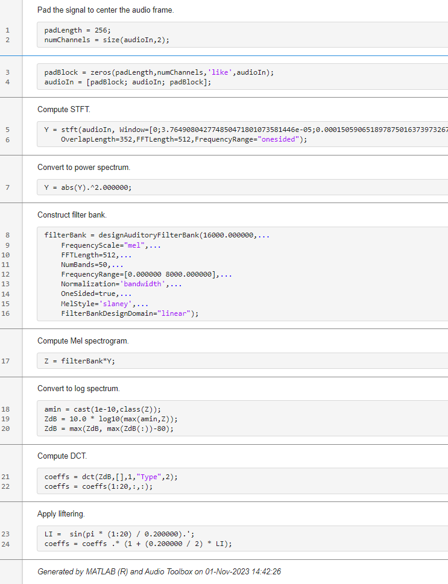
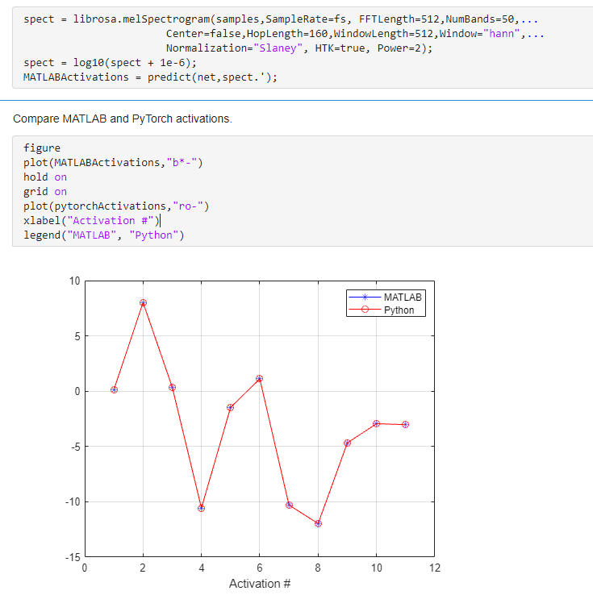

# Convert librosa Audio Feature Extraction To MATLAB

## This example shows how to:

- Convert librosa python feature extraction code to MATLAB.
- Using the MATLAB feature extraction code, translate a Python speech command recognition system to a MATLAB system where Python is not required.

## Overview

librosa is a python package for music and audio analysis. It is often useful to translate a librosa function call to its equivalent MATLAB function call. This is the case for example when you have access to a python script or function, and want to implement it in MATLAB instead. The equivalent functionality is usually available in Audio Toolbox™, but it is not always straightforward to set the MATLAB property values to achieve a match with the librosa function. 

Audio and speech AI systems often include feature extraction. Importing AI audio models trained in non-MATLAB frameworks into MATLAB usually consists of two steps:
- Import the pretrained network to MATLAB.
- Translate the feature extraction performed in the non-MATLAB framework to MATLAB code.

This example focuses on the second step of this process, where it is assumed librosa was used to perform feature extraction. In particular, you learn how to translate librosa feature extraction functions to their MATLAB equivalents. 

The example covers three of the most popular audio feature extraction algorithms:
- Short-time Fourier transform (STFT) and its inverse (ISTFT).
- Mel spectrogram.
- Mel-frequency cepstral coefficients (MFCC).

You also leverage the converted feature extraction code to translate a Python deep learning speech command recognition system to MATLAB. The Python system uses PyTorch for the pretrained network, and librosa for mel spectrogram feature extraction.

For a MATLAB version of this example, refer to [convertLibrosaToMATLABCode.m](convertLibrosaToMATLABCode.m)

## Requirements

- [MATLAB®](https://www.mathworks.com/) R2023b or later
- [Deep Learning Toolbox™](https://www.mathworks.com/products/deep-learning.html)
- [Audio Toolbox™](https://www.mathworks.com/products/audio.html)

The Python code uses the following packages:
- librosa version 0.10.1
- PyTorch version 2.1.0

## Mapping librosa Code to MATLAB Code

### STFT and ISTFT

#### Execute librosa Code

You start with translating STFT and ISTFT librosa code to MATLAB. 

The Python script [librosastft.py](PythonCode/librosastft.py) uses the librosa functions stft and istft.

You can execute Python scripts and commands from MATLAB. For more information about this functionality, see [Call Python from MATLAB](https://www.mathworks.com/help/matlab/call-python-libraries.html) in the documentation. In this example, you use [pyrunfile](https://www.mathworks.com/help/matlab/ref/pyrunfile.html) to run the Python script in MATLAB. pyrunfile allows you to access and use variables from the Python script in MATLAB.

Use pyrunfile to call the Python script librosastft.py. Pass the name of the test audio file as an input argument. Return variables computed in the Python script to MATLAB by specifying them as output arguments. In the code snipped below, you return the following:
* The STFT of the input audio.
* The ISTFT (the reconstructed audio signal).

#### Implement Equivalent MATLAB Code
To perform the equivalent STFT and ISTFT computations in MATLAB, you use the MATLAB functions [librosa.stft](+librosa/stft.m) and [librosa.istft](+librosa/istft.m). The name-value arguments of these functions match the name-value arguments of their librosa counterparts.

Note that calling librosa.stft with no output arguments plots the magnitude of the STFT.

Now compute the ISTFT in MATLAB by using the same name-value arguments as the Python script.

Compare the MATLAB and librosa ISTFT values.

Compute the error.

#### Generate MATLAB Code from librosa.stft and librosa.istft

To generate MATLAB code that implements librosa's STFT with documented MATLAB function, specify GenerateMATLABCode=true in the call to librosa.stft.

The function call generates a live script document containing the code. In this case, the generated MATLAB code uses the function [stft](https://www.mathworks.com/help/signal/ref/stft.html).

### Mel Filter Bank

Next, you map librosa's mel filter bank function to MATLAB. Mel filter banks are integral to mel spectrograms and MFCC computations.

The Python script [librosamel.py](PythonCode/librosamel.py) uses the librosa function mel. Execute the script and return the librosa mel filter bank.

Use [librosa.mel](+librosa/mel.m) to construct the same filter bank in MATLAB.

Similar to librosa.stft and librosa.istft, specify GenerateMATLABCode=true to generate MATLAB code that uses documented functions. In this case, the generated code uses [designAuditoryFilterBank](https://www.mathworks.com/help/audio/ref/designauditoryfilterbank.html):

### Mel Spectrogram

Next, you map librosa's mel spectrogram function to MATLAB. 

The Python script [librosamelspectrogram.py](PythonCode/librosamelspectrogram.py) uses the librosa function melspectrogram. Execute the script and return the librosa mel spectrogram.

Use [librosa.melSpectrogram](+librosa/melSpectrogram.m) to compute the same mel spectrogram in MATLAB.

Compute the error.

Similar to other functions, specify GenerateMATLABCode=true to generate MATLAB code that uses documented MATLAB functions. In this case, the generated code uses stft and designAuditoryFilterBank:

### MFCC

Finally, you map librosa's mel spectrogram function to MATLAB. 

The Python script [librosamfcc.py](PythonCode/librosamfcc.py) uses the librosa function mfcc. Execute the script and return the librosa MFCC values.

Use [librosa.mfcc](+librosa/mfcc.m) to compute the same MFCC in MATLAB.

Compute the error.

Similar to other functions, specify GenerateMATLABCode=true to generate MATLAB code that uses documented MATLAB functions. In this case, the generated code uses stft, designAuditoryFilterBank, and [dct](https://www.mathworks.com/help/signal/ref/dct.html):

## Import Python Speech Command System to MATLAB

You now use the feature extraction mapping functionality to translate a Python pretrained speech recognition system to MATLAB.

### System Description 

The deep learning speech command recognition system was trained in Python.

The system recognizes the following commands:

- "yes"
- "no"
- "up"
- "down"
- "left"
- "right"
- "on"
- "off"
- "stop"
- "go"

The system is comprised of a convolutional neural network. The network accepts mel spectrograms as an input. 

For the training workflow, a supervized learning approach is followed, where mel spectrograms labeled with commands are fed to the network.

The following were used to train the command recognition system:

- **PyTorch** to design and train the model.
- **librosa** to perform feature extraction (auditory spectrogram computation).

You perform speech recognition in Python by first extracting an mel spectrogram from an audio signal, and then feeding the spectrogram to the trained convolutional network.

### Perform Speech Command Recognition in Python

The Python script [InferSpeechCommands.py](PythonCode/InferSpeechCommands.py)  performs speech command recognition. 

Execute Python inference in MATLAB. The Python script prints out the recognized keyword and returns the network activations and the mel spectrogram.

### Convert the Pretrained Network to MATLAB

You first import the PyTorch pretrained network to MATLAB using MATLAB's [model import-export functionality](https://www.mathworks.com/help/deeplearning/deep-learning-import-and-export.html?s_tid=CRUX_lftnav). In this example, you use [importONNXNetwork](https://www.mathworks.com/help/deeplearning/ref/importonnxnetwork.html). The function imports a version of the network that was saved to the Open Neural Network Exchange (ONNX) format. To see how the PytTorch model can be saved to an ONNX format, refer to [convertModelToONNX.py](PythonCode/convertModelToONNX.py).

### Perform Speech Command Recognition in MATLAB

Use librosa.melSpectrogram to perform feature extraction. Call the function with the same name-value arguments as the Python inference.

Verify the spoken command in MATLAB.

